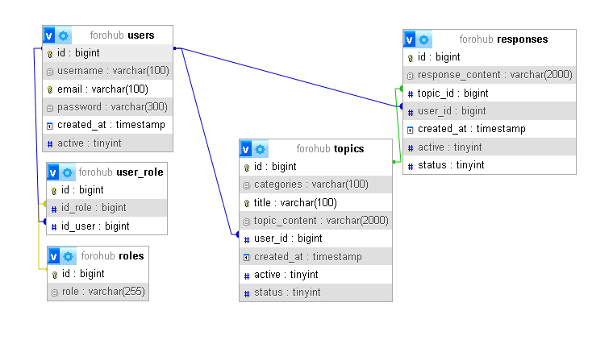
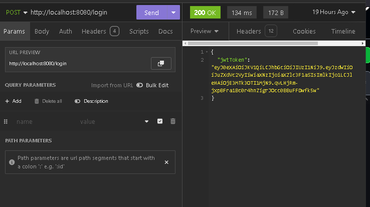
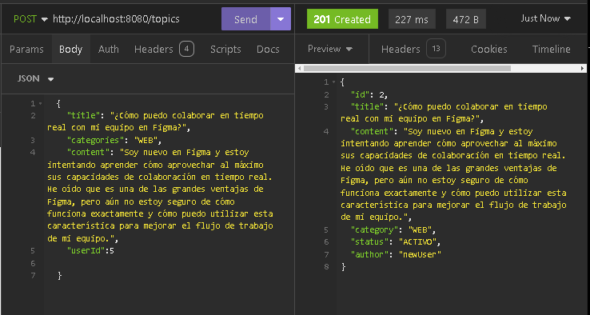
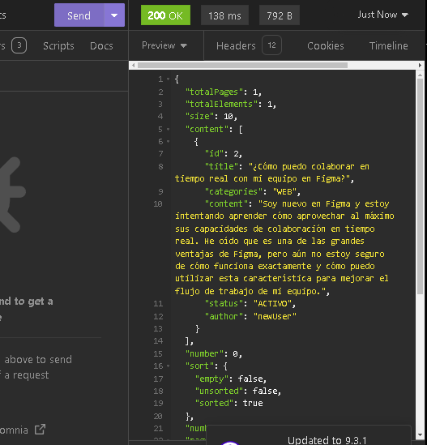
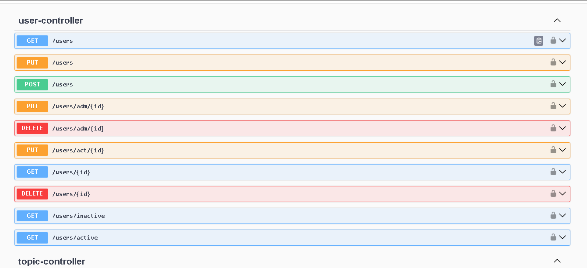

# 💻 Proyecto ForoHub 
Este proyecto, desarrollado en Java y SpringBoot es parte de mi formación en Alura Latam en el área de implementación de API.
La API ForoHub es una API REST dedicada a la gestión integral de un foro, abarcando tópicos, respuestas y cursos. 
Esta API proporciona una variedad de endpoints que permiten realizar operaciones esenciales, como crear, actualizar, listar y eliminar tópicos, respuestas y cursos. 
Además, incluye funcionalidades avanzadas para filtrar tópicos según diferentes criterios, facilitando la búsqueda y organización de la información. 
Con ForoHub, los desarrolladores pueden construir y mantener foros dinámicos y eficientes, optimizando la interacción y el intercambio de conocimientos entre los usuarios.

# 📏 Reglas de Negocio 

### 1. Registrar Tópico 
Los usuarios autenticados pueden crear nuevos tópicos en el foro. Cada tópico debe incluir un título claro, una descripción detallada y etiquetas relevantes para facilitar la búsqueda y la organización.

### 2. Eliminar Tópico 

Los administradores pueden eliminar lógicamente un tópico del foro. Esta acción es reversible.

### 3. Actualizar Tópico 

Los administradores y los moderadores pueden actualizar la información de un tópico, incluyendo el título, la descripción y la categoría asociada.

### 4. Autenticación 

Los usuarios deben estar autenticados para participar en el foro, ya sea para crear, actualizar o eliminar tópicos. La autenticación debe asegurar la identidad del usuario y proteger la integridad del foro
mediante el uso de JWT.

### 5. Listar Tópicos 
Todos los usuarios, autenticados o no, pueden ver la lista de tópicos disponibles en el foro. La lista debe ser filtrable y ordenable por diferentes criterios, como fecha de creación o alfabéticamente.

### 6. Crear una Respuesta 

Tanto Administradores como usuarios, pueden añadir respuestas a los tópicos para facilitar la interacción de la comunidad.

### 7. Actualizar una Respuesta

Es posible modificar el contenido de las respuestas agregadas en un tópico particular, a manera de corrección en caso de errores de escritura u otros inconvenientes.

# 🎁 Funcionalidades Adicionales 
Opté por implementar algunas funcionalidades más a fin de hacer este pequeño proyecto más completo en cuanto a gestión por
parte de los administradores del mismo.

- Eliminar lógicamente usuarios.
- Eliminar lógicamente tópicos.
- Eliminar lógicamente Tópicos y sus respuestas.
- Estandarizado de Retornos API
- Autenticación StateLess
- Cifrado de Contraseñas (Bcrypt)
- Autorización de métodos mediante Roles
- Seguridad mediante JWT (Generacion de Tokens).
- Protección contra Ataques (clickjacking)
- manejar los estados de los tópicos (Abierto, Cerrado, Archivado, Anclado).s.

# 🛢Esquema de Base de datos

# 🚀 Despliegue

Sigue estos pasos para ejecutar el proyecto en tu equipo, recuerda tener instalado el JDK.

- Clona el repositorio en tu equipo.
- Importa el proyecto a IntelliJ u otro IDE que soporte Java
- Crea la base de datos "forohub" en MySQL
- Configura las variables de entorno para la BD y JWT en application.properties
- Ejecuta el proyecto
- Crea y prueba las requests en algún Rest Client como Insomnia o Postman
- También puedes probar el proyecto con SpringDoc, usando la herramienta Swagger

# Ejemplo de funcionamiento

Para la demostración de esta aplicación podemos hacer uso de insomnia o Swagger para probar cada uno de los endpoints.

### Login:

### Insertar un tópico:

### Listar un Tópico:

### Vista de endpoints en Swagger-ui:

# 🔧 Tecnologías Utilizadas 

	<code></code>
	<code></code>
	<code></code>
	<code></code>
	<code></code>
	<code></code>
  	<code><a href="https://flywaydb.org/" target="_blank"></code>
	<code><a href="https://insomnia.rest/download" target="_blank"></code>

# 👤 Acerca De 

Soy Christian Estupiñan, un joven desarrollador Jr. comprometido con el aprendizaje continuo y con la meta de convertirme en desarrollador full-stack.
